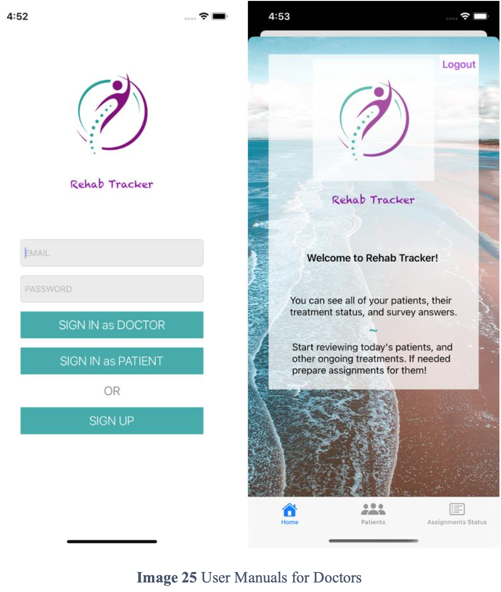
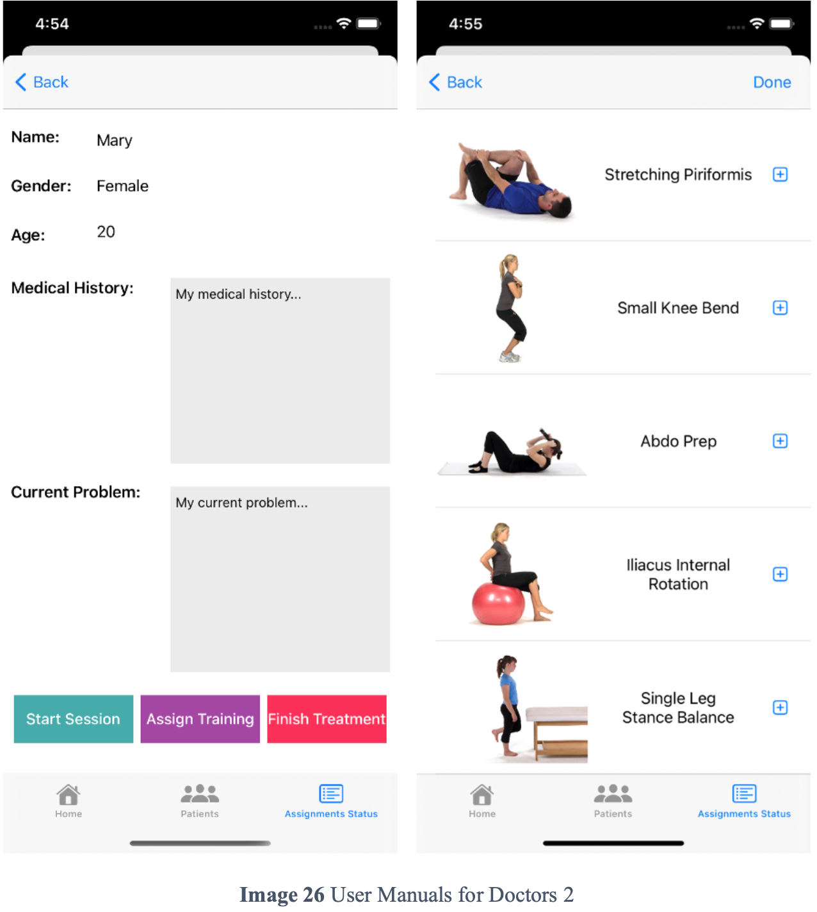
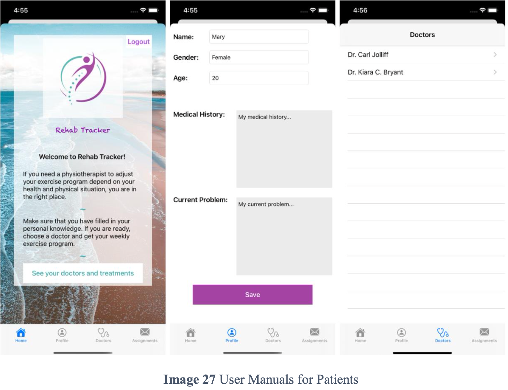
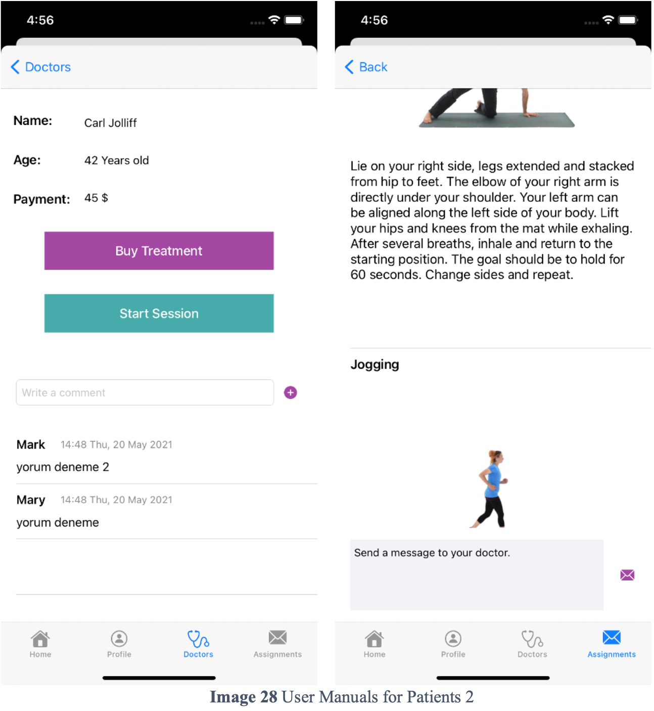
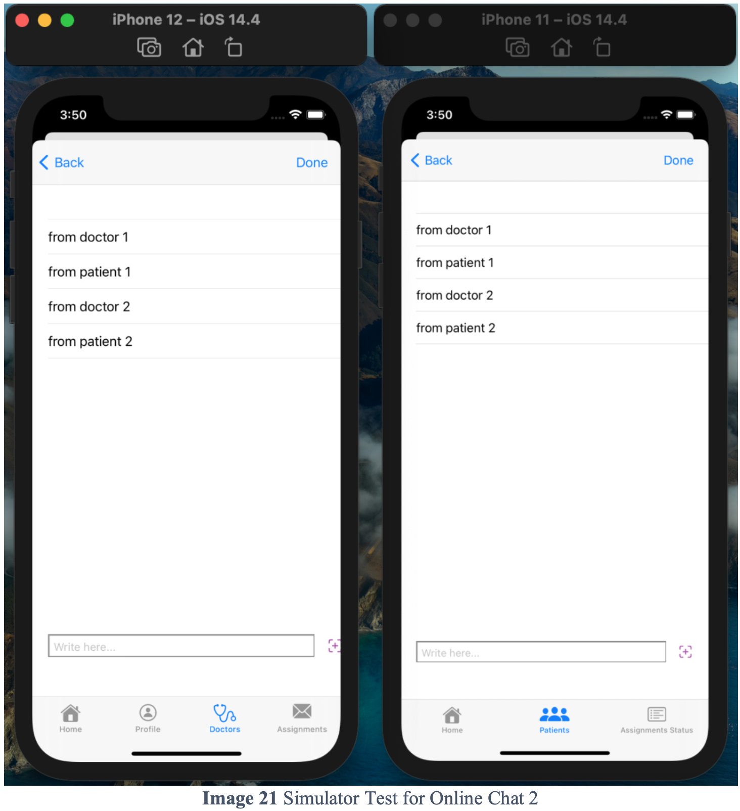

# RehabTracker

- Rehab Tracker is my graduation project. It is a type of smart health consulting system for physiotherapy. 
- Rehab Tracker serves for two kinds of users; doctors and patients. In my model, doctors are already registered in the system. Patients have to be signed up with personal information and then sign in to get an appointment. 
- Appointments are made as online chats. 
- There are screens like login, profile, doctors list, patients list, chat sessions, exercise lists, and assignments.
- The patients can make comments about the doctors that they got treatment. 

- As well as the project is written in MVC architecture, also there is an example of how MVVM architecture can be used in iOS programming via protocols. I wrote unit tests to that MVVM example.  

- I used:
   - Swift as the programming language,
   - Firebase as backend infrastructure,
   - Cloud Firestore as database, and
   - CocoaPods as dependency manager
   

   
  
